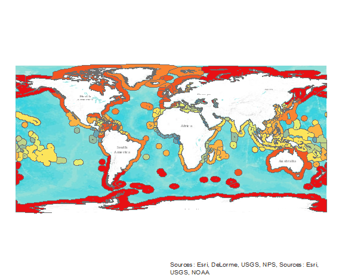

# Lab 2

## Map of Max Wind Speed by EEZ for Each Country

## Summary of Top Countries

The top 3 countries by MAX wind speed in their EEZ:

1. Heard and McDonald Islands
2. Kerguelen Islands
3. Crozet Islands

The top 3 countries by MEAN wind speed were:

1. Crozet Islands
2. Macquarie Island
3. Kerguelen Islands

#Script

