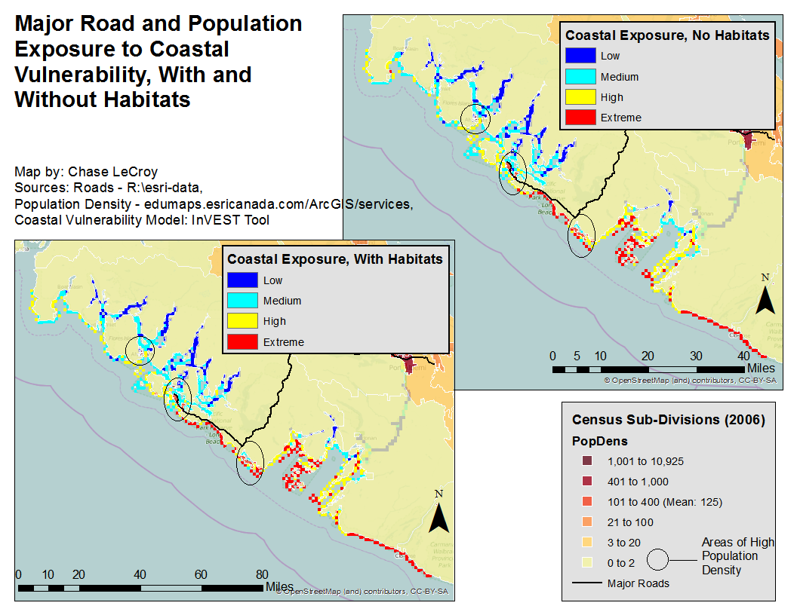

# Lab 3

## Coastal Vulnerability Based on the InVEST Tool

## Brief Description of Key Findings

  A major road and three locations of high-density population are exposed to coastal risk. Unexpectedly, the road for most of its coastal length and one population density center (South) is exposed to greater risk with habitats present. A portion of road near where it turns northward is subject to more risk without habitats, while the central population density center has about the same risk under both scenarios. The North population density center has reduced risk with habitats. The greatest risk reduction would be provided by restoring habitats along the stretch of coast where the road turns northward as it would lower risk for the road and population center. The northern population center would also benefit from habitat restoration.

