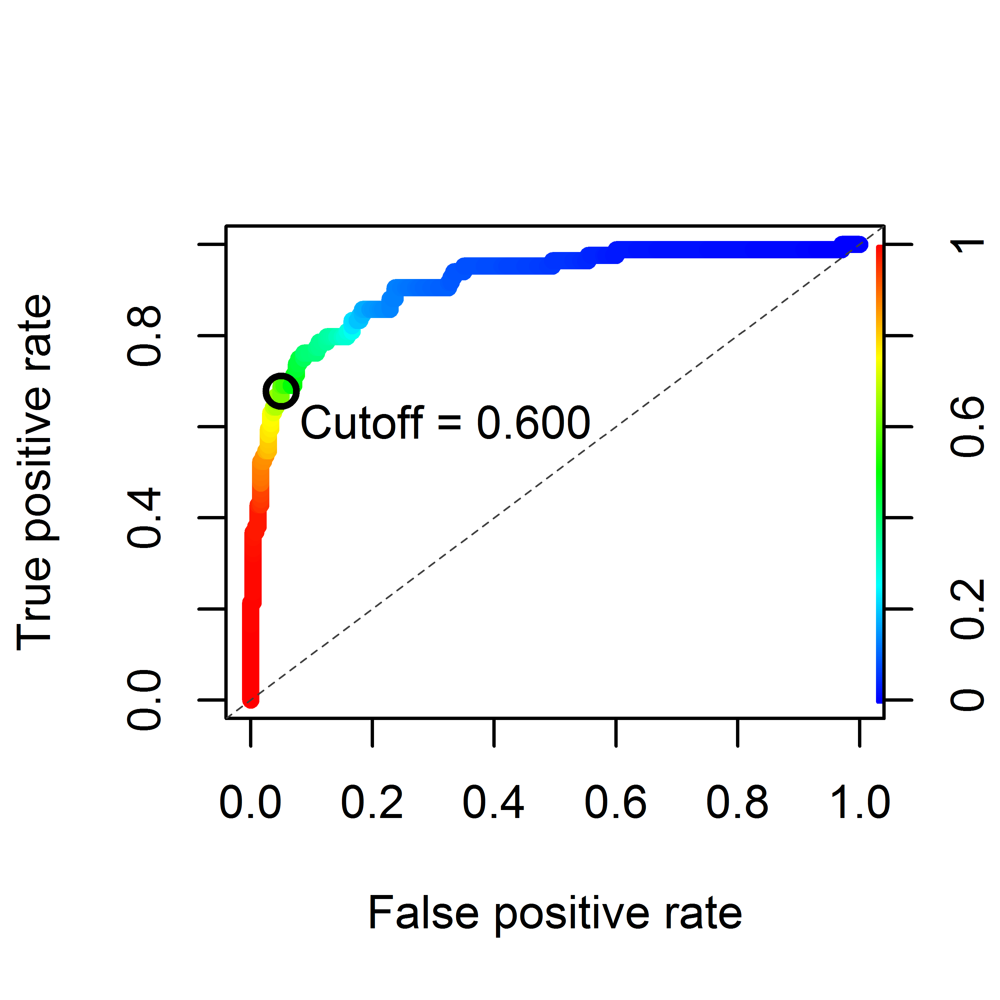

##Lab 4 Map

##Diagnostic Plot

##Model Details

logistic regression
presence ~ cb2.3mbath + cb2.3mslop + cb2_3mvrm

Coefficients:
             Estimate Std. Error z value Pr(>|z|) 
             
(Intercept) 4.859e+00  8.150e-01   5.962 2.49e-09

Bathymetry  6.981e-02  8.314e-03   8.397  < 2e-16 

Slope       2.194e-01  4.594e-02   4.774 1.80e-06 

Roughness   1.101e+03  3.716e+02   2.962  0.00305 

---

Df Deviance Resid. Df Resid. Dev  Pr(>Chi)  

NULL                         648     706.51  

cb2_3mbath  1  268.438       647     438.08 < 2.2e-16 

cb2_3mslop  1   96.508       646     341.57 < 2.2e-16 

cb2_3mvrm   1   16.031       645     325.54 6.231e-05 

---

Deviance explained = 53.9%

Variance Inflation Factors:

Slope      1.671412
Bathymetry 1.587415
Roughness  1.408617

##Model Performance

Area under the ROC curve (auc)    = 0.913

User-specified cutoff             = 0.600

Cohen's kappa (K)                 = 0.667

Accuracy (acc)                    = 0.880

Error rate (err)                  = 0.120

True positive rate                = 0.679

False positive rate               = 0.050

True negative rate                = 0.950

False negative rate               = 0.321
