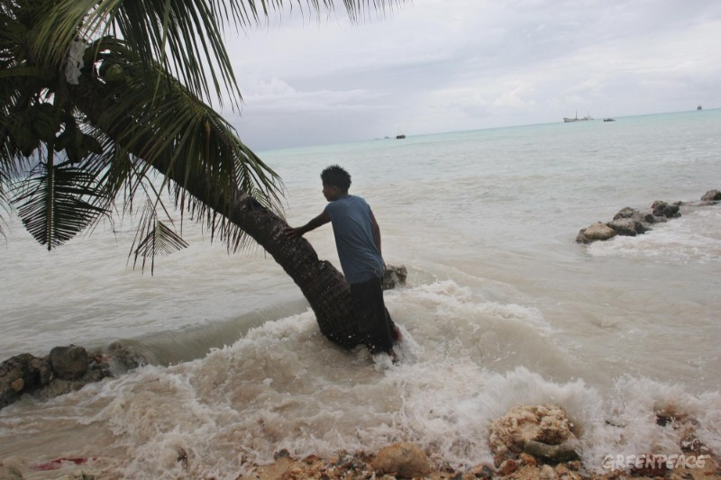
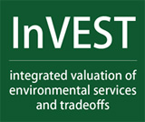

###### Chase LeCroy
###### ESM 296
###### 10/10/2014

## Project Proposal
### Ecosystem Services

*Source: http://www.greenpeace.org/international/Global/international/planet-2/image/2006/4/pita-meanke-of-betio-village.jpg*

As the harm inflicted by humans on the Earth continues to rise, more focus is being placed on the benefits the environment provides.  These processes, performed by natural earth systems, are increasingly being studied and quantified as ecosystem services.  However, our understanding of the exact nature of ecosystem services and our ability to translate them into accurate dollar values is still developing. The InVEST tool, developed by the Natural Capital Project, is an attempt to allow for the rapid deciphering of ecosystem services through the analysis of management decision costs, benefits, and tradeoffs.  

I plan to use this tool in an analysis of coastal vulnerability for a low elevation island nation (to be determined). Many island nations have extreme levels of coastal vulnerability from sea level rise due to their low lying structure. In addition, a lack of economic resources and political strength are barriers to the protection of their lands.  Therefore, any management alternatives must be heavily scrutinized for feasibility and effectiveness as it is not likely for the island nation to be able to pursue multiple prospects simultaneously. During the course of the project I will cultivate technical skills related to the class’s objectives, such as advanced GIS modeling techniques, and learn new skills, including interfacing between ArcGIS, Python scripts, R, and the InVEST tool itself.  Data used will include Wavewatch III, DEMs, and other data extracted by the InVEST tool. The ultimate goal of the project is to create a basic management plan for the country that assesses coastal vulnerability under different scenarios while acknowledging the value of ecosystem services such as reliable seafood supply and protection from storms.  Results will most likely be communicated as maps and tables.

*Source: http://naturalcapitalproject.org/InVEST.html*